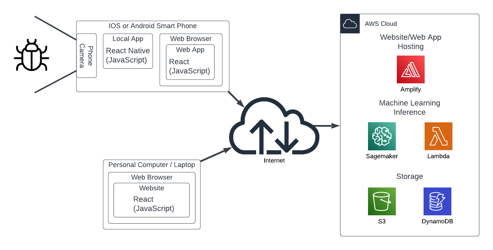

# Developer Guide
Clone the repository from https://github.com/AJBuilder/pest-identification-sd.git in order to get the app code for the front end and back end. 

***
## Table of Contents

- [Developer Guide](#developer-guide)
  - [Table of Contents](#table-of-contents)
  - [Architecture](#architecture)
    - [Cloud Architecture](#cloud-architecture)
    - [App Architecture](#app-architecture)
  - [Further Development](#further-development)
    - [Setting Up your AWS cloud account](#setting-up-your-aws-cloud-account)
    - [App Development](#app-development)
    - [ML Model Development](#ml-model-development)
    - [Backend Modifications](#backend-modifications)
      - [Lambda Scripts](#lambda-scripts)
      - [Datamodels](#datamodels)

***
## Architecture

### Cloud Architecture

The main services interacted with during development are Amplify, Sagemaker, and Lambda. S3 and DynamoDB are also used, but most of their use is behind Amplify's [Storage](https://docs.amplify.aws/lib/storage/getting-started/q/platform/js/#automated-setup-create-storage-bucket) and [Datastore](https://docs.amplify.aws/lib/datastore/getting-started/q/platform/js/) Javascript APIs. Additionally, Cognito and AppSync are also used, but require very little interaction during development as they are utilized by Amplify.

### App Architecture

The app is built with [React](https://react.dev/) and utlizes a lot of AWS Amplify React [ui-components](https://ui.docs.amplify.aws/?platform=react) and [APIs](https://docs.amplify.aws/lib/q/platform/js/). Some of the app screens also utilize [Tailwind](https://tailwindcss.com/) and were modified from templates found online.

And as of commit [2de4390](https://github.com/AJBuilder/pest-identification-sd/commit/2de4390efc1e3fc8fd7b7490726ac11b4fe9be5b), App.jsx is the parent component rendered by `root.render()` in [index.js](../src/index.js). This [App.js](../src/App.js) renders one component, [Menu.jsx](). This menu renders the different pages of the app within it according to what is selected in the menu.

The existance of App.js even though it only has one child is the result of the development process. Its an artifact that wasn't removed because it works, and wasn't worth the time to rework. Although, App.js could could be useful if a loading page is desired before showing the menu component. Additionally, App.css ensures that the App is the full viewport. In the future, to account for how different browsers display the viewport, further code can be employed in App.js/App.css to ensure the app is properly filling the screen. (Currently there are some issues with Safari) Child components do not have to worry about the viewport and can simply fill 100% of App.js.

In summary, the React component architecture is:
- index.js
  - App.js
    - Menu.jsx
      - (Home page)
      - (Identify page)
      - (Discussion page)
      - (Reports page)

***
## Further Development

### Setting Up your AWS cloud account
Dr. Flor has access to the root account. We have also created further administration accounts for developers.

### App Development

There are two main dependencies that must be installed

- [Node.js](https://nodejs.org/en/download) and [NPM](https://docs.npmjs.com/getting-started/)
- [Amplify CLI](https://docs.amplify.aws/cli/)

Before working on the app, the dependencies must be installed. Dependencies are not saved on the repo. Running `npm install` or `npm i` will install all the Node.js packages in `node_modules`. What packages are installed depends on what is listed in [packages.json](../package.json) (although technically [package-lock.json](../package-lock.json))

The common workflow for app development starts with ensuring the proper AWS backend and config is updated from the cloud. This is so that the app can properly interact with the updated backend. This can be done using `amplify pull`. This data is also stored on the repo, but must be updated whenever there is a backend changed. Pulling will also pull and of the generated UI components that were created in the Amplify GUI. As of commit [2de4390](https://github.com/AJBuilder/pest-identification-sd/commit/2de4390efc1e3fc8fd7b7490726ac11b4fe9be5b), there are no auto generated UI components.

If the backend is up to date, workflow can proceed. During development, only a development build is necessary to test changes. Using `npm start`, a development build of the app is made. A browser window should automatically open on `http://localhost:3000`. (If WSL is being used, you may have to forward network traffic to localhost:3000 to the WSL IP. [There are a few ways to do this.](https://stackoverflow.com/questions/64513964/wsl-2-which-ports-are-automatically-forwarded)) Whenever you save a file in the app, the development server quickly rebuilds the app.

Note that this is very different from `npm build`. This will create a production build of the app, which is unecessary and takes awhile. However, this is what will be done whenever the app is built in the cloud.

Amplify will automatically rebuild and deploy the app whenever there is a commit to the "main" branch in the repo. It is advisable to create a "dev" branch seperate from the "main" branch so that in-progress features can be saved to the repo without being deployed. This was not done as no one is using the app.

If the app is being utilized by users, a development hosting and backend should be setup. A "hosting environment" is the web accessible build of the app. As of now, there is only one deployment tracking the "main" branch. This environment is utilizing the "staging" backend. (The name should probably be "release" or "production") What backend the hosting environment uses can be configured.

The purpose of multiple hosting and backend environments is so that a new app build can be tested in the cloud without disrupting the users. **As of now, this is not done.**

### ML Model Development

### Backend Modifications

#### Lambda Scripts

#### Datamodels
