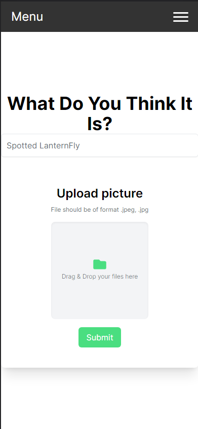

## User Guide For Grape Guard

### Getting Started
Grape Guard is an application designed for grape farmers to interact with to help them identify Spotted Lantern Flies and Grape Berry Moths on their vineyards. The concept of the application was brought about by Dr. Flor Acevedo, a professor in the College of Agriculture Sciences at Penn State Behrend. Dr. Flor is a part of a board of experts who have to handle helping farmers with identifying these invasive pests. In order to deal with the amount of time and quantity of requests, Dr. Flor is looking to implement some system or application that these farmers can use so that they can get an immediate answer to their questions without having to wait for an expert. 

Grape Guard implements an application that allows users to send images to be classified using a machine learning model trained to classify Spotted Lantern Flies and Grape Berry Moths. The application also includes additional features that users can use to obtain more information about these two pests and have conversations with other farmers who may be experiencing similar issues. Grape Guard was also designed to allow experts to use the information gathered by the application for research and analytical purposes. 

The rest of this section of documentation will walk through the various ascepts and features of Grape Guard and how they can be used. 

### Setup and Account Creation
 1. Navigate to [Grape Guard](https://main.dj2fy9i64709.amplifyapp.com/) through the embedded link which will bring you to the live hosted version of this project that is available to use for free upon signup.
 2. (Mobile Only) For Best results for now in regards to sizing on the device screen you will need to add it to your home screen. To do this, you will want to hit the options icon within your mobile browser and look for the add to home screen button and click it. Once you click it you will be prompted by your phone to either add or decline. Go ahead and press add.
 3. Navigate to where the app was placed on your home screen and click on it. 
 4. Once here you will be brought to a sign-in screen. If you already have an account this is where you can sign in. If not please click create an account. 
 5. Complete the account creation form with all values and make sure to also include a valid email as it will send you an account creation code to verify your account. 
 6. Navigate to your email and retrieve the prompted code for account creation and put it into the corresponding location where it is asking for it. Then press submit!
 7. You now have an account and an easy way to access Grape Guard on the Go!

### Navigation of the App 

 1. After you have signed into the app you will be brought to the home page. Here you can read some information about the app and the project as well as a brief introduction to the invasive species we were trying to automatically identify.
 
 

  

 
 2. To navigate between pages you can click the three bars at the top of the screen which will bring you to a dropdown menu. The current page you have selected will appear in green. You may navigate to any page you wish. More information about each page in their own sections. **Note: Clicking the Sign Out button will sign you out of the app forcing you to log back in**

 

  
  

### The Identify Page

 - Things you can do within the identify page include: 
	 - Selecting what you believe the pest is through a dropdown selection. If you do not know simply select that you do not know.
	 - The identification section with the folder icon allows you to click on it and either upload a photo from your gallery or take a new one. Once you confirm that this is the photo you want to identify all you have to do is click submit. The button will turn from green to blue and this is how you know your report was submitted.
	 - It will take a second for your response so feel free to navigate to other pages.

  

### The Discussion Page

 - Things to do in the discussion area:
	 - You can make a post with any questions that you have about anything in regards to these pests and what to do about them if you spot them.
	 - You can also view other peoples posts and replies to try and get some immediate feedback about your questions.

  

### The Reports Page

 - Things to do in the reports area:
	 - This is where all of the reports go once they are submitted. This allows you to track what reports others are making in the vicinity.
	 - To better see this spread you can click the map button to view point drops on a map and even click on them to see their corresponding report. 
	 - Through the reports including the map page you can filter by various amounts of categories to limit what you are see as well. 

  
  

